<div align="center">


[](https://git.io/typing-svg)

<br/>

[](https://github.com/IrbaazN)
[](https://www.linkedin.com/in/irbaaz-noor/)
[](https://www.instagram.com/irbaaznoor_/)
[](mailto:noorirbaaz@gmail.com)

</div>

---

## 🧠 About Me

```python
class AIEngineer:
    def __init__(self):
        self.name       = "Irbaaz Noor"
        self.location   = "India 🇮🇳"
        self.role       = "AI Engineer"
        self.focus      = ["LLM Architectures", "Fine-Tuning", "RAG Systems", "Multi-Agent AI"]
        self.stack      = ["Python", "OpenAI API", "HuggingFace", "FastAPI"]
        self.philosophy = "Impactful AI solves real problems for real people."

    def currently(self):
        return {
            "building"  : "Production-grade AI APIs & intelligent systems",
            "exploring" : "Generative AI, Retrieval-Augmented Generation",
            "open_to"   : "Collaborations, open-source, exciting AI projects"
        }

me = AIEngineer()
```

---

## 🌐 Connect With Me

<div align="center">

[](https://www.linkedin.com/in/irbaaz-noor/)
[](https://www.instagram.com/irbaaznoor_/)
[](mailto:noorirbaaz@gmail.com)

</div>

---

## 💻 Tech Arsenal

<div align="center">

### 🐍 Core Language


### 🤖 AI / ML


### ⚡ Backend & APIs


### ☁️ Cloud & Databases


### 🛠️ Tools & Design


</div>

---

## 📊 GitHub Stats

<div align="center">



<br/><br/>


</div>

---

## 🏆 GitHub Trophies

<div align="center">


</div>

---

## 🔝 Top Contributed Repos

<div align="center">


</div>

---

## ✍️ Dev Quote of the Day

<div align="center">


</div>

---

<div align="center">


*"The most impactful AI isn't just technically sound — it solves real problems for real people."*

</div>
